# Mini E-Commerce App

A mobile e-commerce application built with **Flutter**, offering core shopping functionalities. It features **clean code practices**, **Bloc/Cubit state management**, and **Lottie animations** for a modern UI/UX experience.

---

## Features

| Feature | Description |
|---------|-------------|
| **Categories Page** | Displays a **Lottie animation** at the top and lists categories in a responsive grid. |
| **Product List** | Shows products for each category, including image, name, and price. |
| **Favorites** | Liked products are collected on the favorites page. |
| **Cart Management** | Add/remove products, increase/decrease quantity, and calculate totals. |
| **Themes** | Supports both light and dark themes. |

---

## Technologies Used

- **Flutter**  
- **Bloc / Cubit** (State Management)  
- **Lottie** (Animations)  
- **Firebase** (Data source & authentication)  
- **Clean Architecture** (Repository-Service pattern)
- **CachedNetWorkImage**
- **RestAPI** (Fake Api)

---

## Screenshots

|  |  |  |
|--|--|--|
| 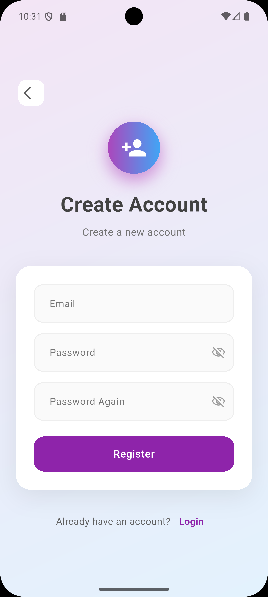 | 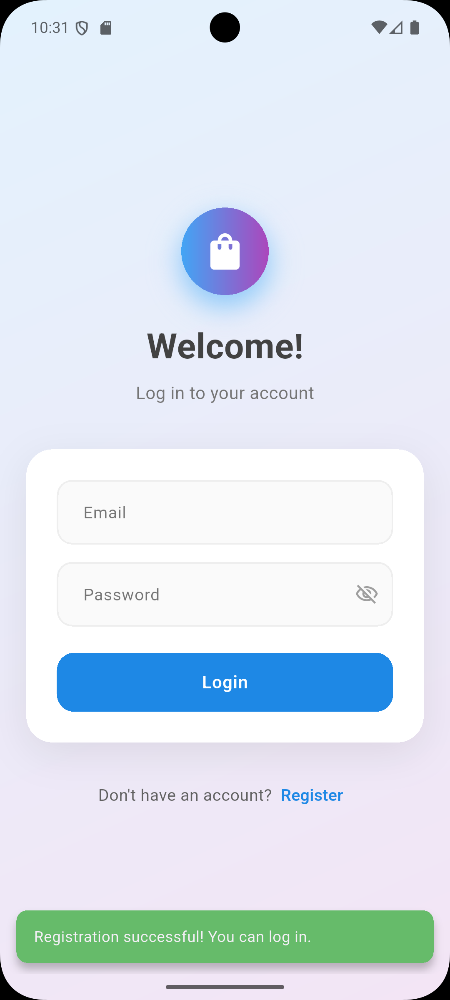 | 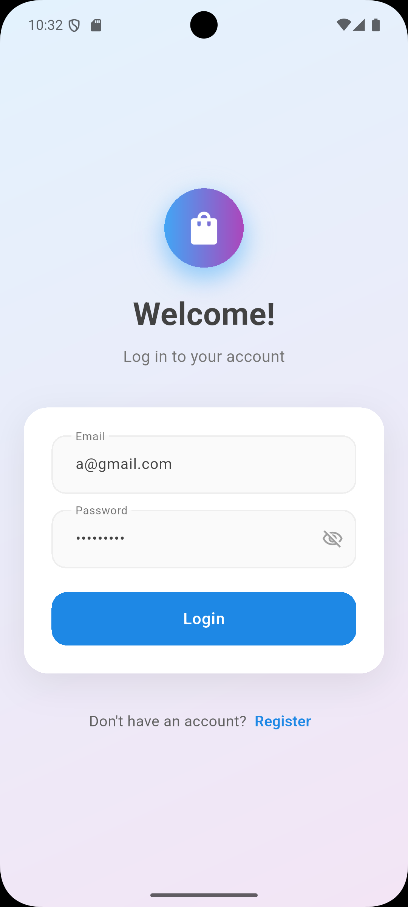 |
| 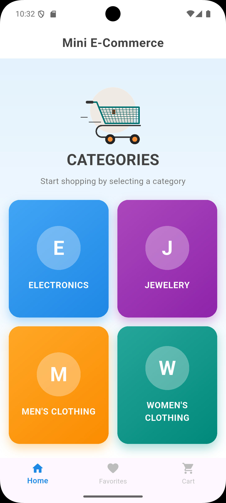 | 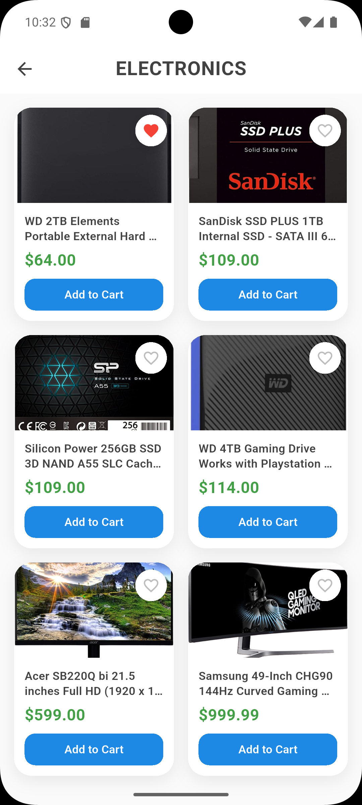 | 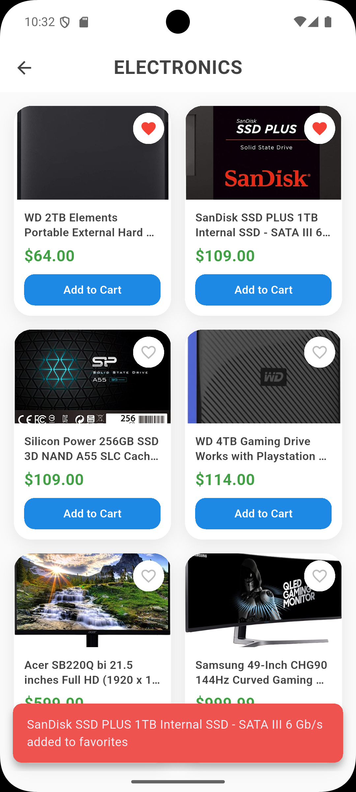 |
| 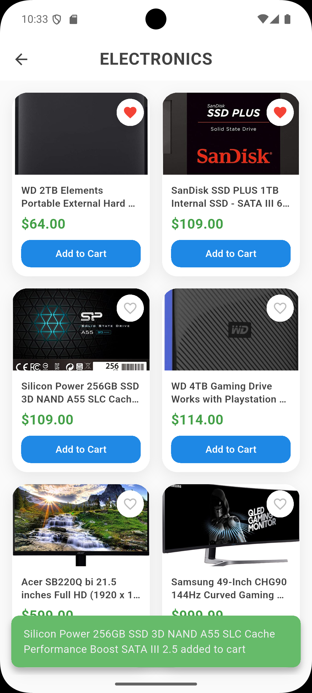 | 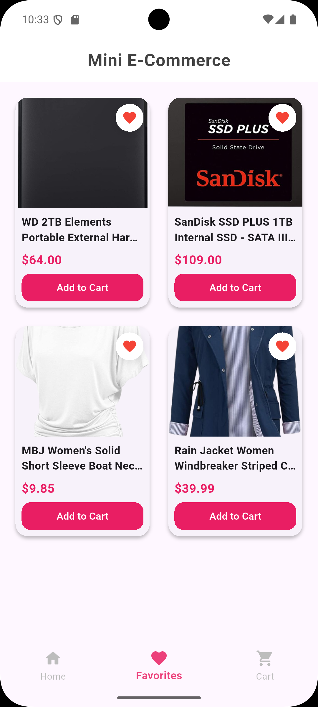 | 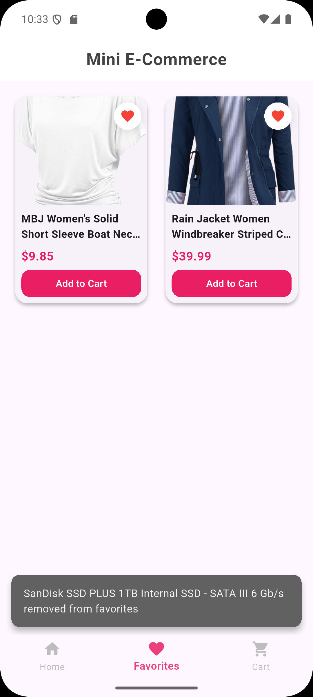 |
| 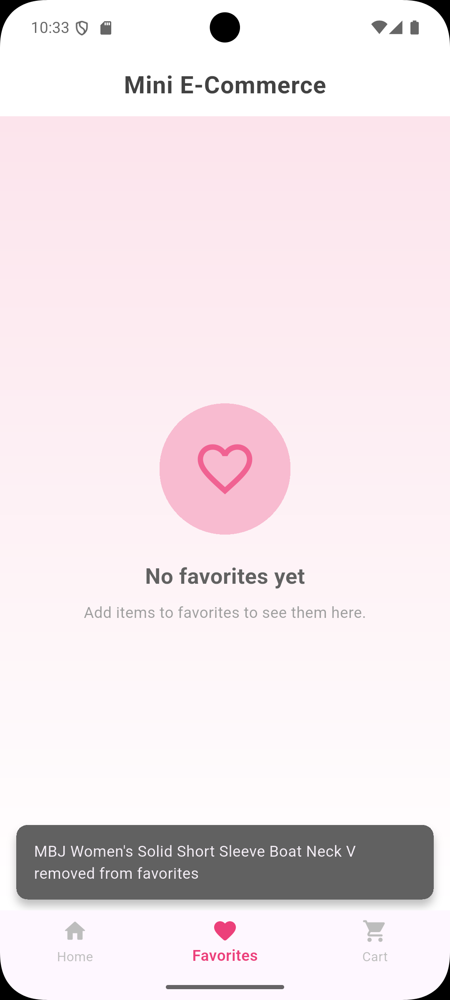 | 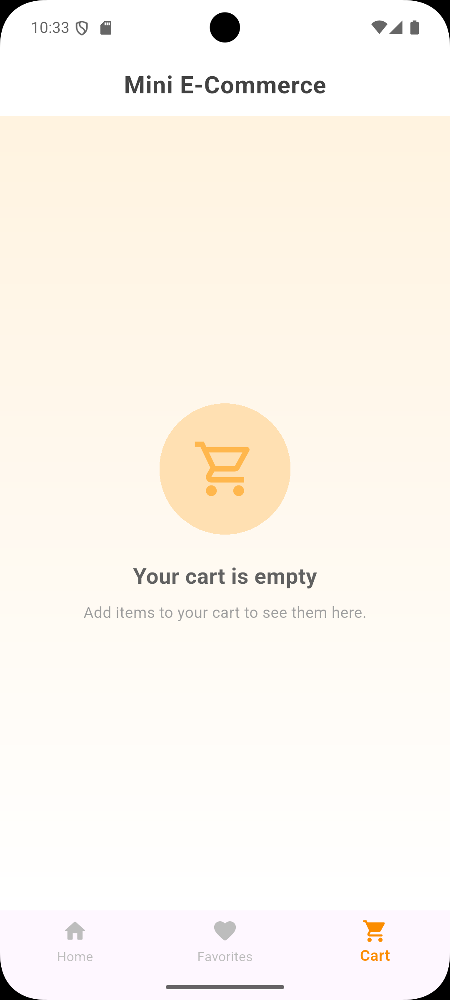 | 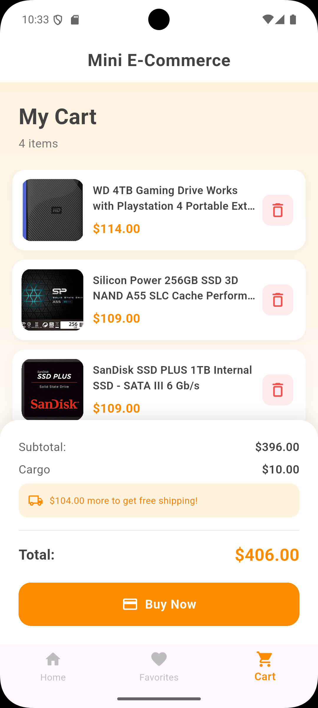 |
| 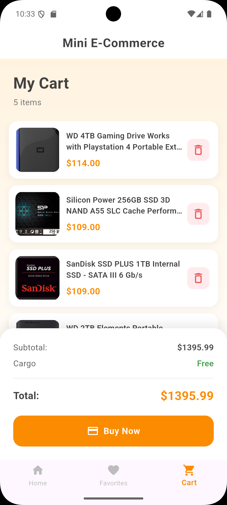 |
---

## Setup

1. Make sure you have the **Flutter SDK** installed.  
2. Clone the project:

```bash
git clone https://github.com/username/mini_e_commerce_app.git
cd mini_e_commerce_app
